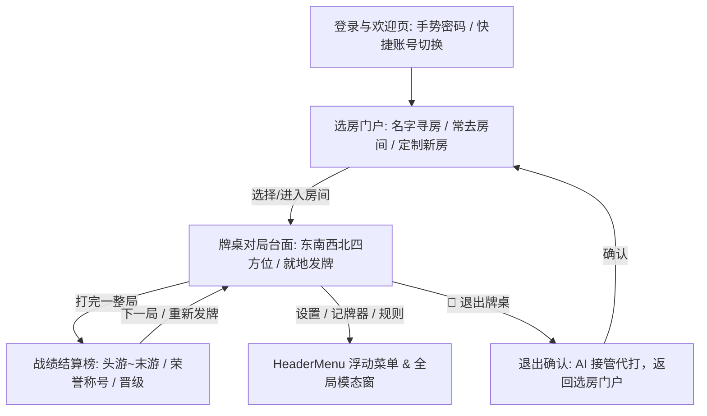

# Gameday · 产品规格与设计全景 (PRODUCT.md)

> **家庭联机游戏平台**（首发游戏：经典掼蛋，储备游戏：双升/拖拉机）。
> 手机浏览器打开即玩，无需下载安装；人数不够由智能机器人补位，对新手做出牌限制、实时分析与引导。

---

## 1. 产品背景与定位

### 1.1 目标人群与典型场景
- **核心人群**：家庭成员（如家长与孩子、亲友聚会），通常 2 人为主，偶尔 3~4 人。
- **痛点分析**：
  1. **规则复杂门槛高**：掼蛋包含 10 余种牌型、逢人配万能牌、进贡还贡，新手记不住规则，常因“出不合法的牌”产生挫败感。
  2. **人数凑不齐**：线下打掼蛋/双升必须严格 4 人。家里只有 2 个人时无法开局。
  3. **现有商业游戏体验臃肿**：市面手游充斥充值入口、广告、沉迷机制，界面繁杂，不适合孩子与家庭健康互动。
- **核心指标（成功标准）**：
  - 孩子或无基础新手能在**无需大人实时讲解**的情况下，通过系统的“规则约束 + 智能提示”独立打完一整局，并自然熟悉规则。
  - 随时随地拿出手机打开网页，**1~4 人任意人数**均可在 5 秒内畅快开打。

### 1.2 需求映射矩阵

| # | 原始用户诉求 | 产品落地设计 | 技术支撑与实现 |
|---|---|---|---|
| **1** | 1–4 人任意玩，缺人自动补齐 | 房间固定 4 席，空位由启发式 AI 机器人补位 | `packages/bot` 启发式策略树 + Durable Object 自动轮询 |
| **2** | 手机端易用、直观、沉浸 | 移动端优先（Mobile-First），点选大按钮出牌，支持竖屏/横屏一键切换 | 响应式 CSS Grid/Flexbox + 纯 CSS 90° 旋转自适应引擎 |
| **3** | 不懂规则，防止乱出牌 | 规则限制非法出牌 + 实时教练指导 + 一键最优出牌提示 | 客户端与服务端同构共用 `packages/rules` |
| **4** | 房间多桌支持与游戏限制 | 房间内支持多张牌桌（掼蛋 + 双升开发中），严格 4 人桌，第 5 人满员保护 | 房间大厅导航 + Durable Object 状态预检 API + 409 拒绝 |
| **5** | 随时可中途安全退出 | 游戏中右上角常驻安全退出通道，防误触弹窗，AI 自动接管 | WebSocket `{ type: 'leave' }` 协议 + 席位解绑 AI 托管 |
| **6** | 零作弊与纯净无广告 | 服务端加密隔离手牌，免登录免广告，打开即玩 | Cloudflare Workers + Durable Objects 边缘架构 |

---

## 2. 核心架构与设计哲学

### 2.1 规则引擎是一切的核心
掼蛋包含单张、对子、三张、三带二、顺子、三连对（木板）、三同连张（钢板）、4~8张炸弹、同花顺、四大天王。再叠加**级牌**（逢人配万能牌），合法性判定是一个带通配符的高维组合搜索问题。

我们将规则设计为单一权威出口：
```ts
getLegalPlays(hand: Card[], lastPlay: Play | null, level: Rank): Play[]
```
- **UI 限制层**：用户点选的牌如果不属于合法牌型或压不过上家，出牌按钮置灰并实时提示原因。
- **UI 提示层**：点击【提示】，从合法牌型中挑出消耗最小的最优解自动高亮。
- **AI 决策层**：Bot 在候选合法出牌空间中执行启发式剪枝出牌。
- **服务端防作弊**：服务端复用同一套规则进行二次强校验。

### 2.2 服务端绝对权威与隐私隔离
- **零透视作弊**：服务端下发状态时，针对每个连接单独投影（Projection），玩家**只能收到自己的 27 张手牌**和其他玩家的剩余张数与打出的牌，协议层杜绝通过浏览器 DevTools 窥视全场手牌。
- **单例状态常驻**：一个房间 = 一个 Cloudflare Durable Object 实例，内存常驻，避免分布式状态同步的不一致问题。
- **并发锁机制**：利用 `ctx.blockConcurrencyWhile()` 确保房间读写存储的原子性，杜绝多连接并发到达导致的并发竞态。

### 2.3 健壮的生命周期与托管哲学
- **主动退出**：玩家确认退出，席位彻底解除绑定，转由永久 AI 替补，原局不阻断，退出者返回房间大厅。
- **被动掉线（锁屏/来电/断网）**：保留席位所有权，后端 Alarm 定时器驱动 AI 临时出牌；玩家重新联网打开后凭借本地设备凭证（`playerId`）秒级认领手牌与控制权。
- **4人满员保护**：对局启动后席位锁定，外部第 5 人访问时，大厅展示 `🚫 满员进行中`，入座入口关闭，WebSocket 建立请求直接被 409 拒绝。

---

## 3. 用户界面与交互系统 (Mobile-First)

### 3.1 页面流转架构 (方案A 极致精简直通流)



### 3.2 界面交互特色
- **极简直通牌桌（Zero-Intermediate Flow）**：
  - 彻底移除旧版冗余的“等待大厅/准备室”中间跳转页，选房后直通牌桌，桌面正中直接提供开局发牌与微信邀请，即开即打。
- **东西南北标准方位体系与沉浸角色胶囊**：
  - 牌桌统一采用“南位自我、北位搭档、东/西位对手”的四方竞技排布，席位卡片精简为单一状态胶囊，并统一高亮呼吸轮次框。
  - 左上角融合双方战队“打几”与庄家级牌信息，右下角提供横竖屏一键悬浮切换。
- **独立设置与记牌器模态窗**：
  - 将记牌器（未出的大王/小王/级牌/A/K张数实时统计）与对局设置收敛进独立模态窗，牌桌视觉极致干净、无重叠遮挡。
- **双模屏幕自适应**：
  - **竖屏模式（单手操作）**：适合碎片化单手点选，卡片垂直流式排布。
  - **横屏模式（宽屏沉浸）**：顶部状态精简，手牌弧形平铺，视觉舒展，防止误触。右上角一键切换，支持物理横屏与强制旋转。
- **多感官交互**：
  - 点选选中、取消、出牌、轮到我、获胜等场景配备专属音效与触感震动反馈。

---

## 4. 技术栈选型

| 模块 | 技术选型 | 优势与考量 |
|---|---|---|
| **开发语言** | TypeScript 5.8 | 跨前后端同构，完全类型安全 |
| **包管理** | pnpm 10 (Monorepo) | 严谨的依赖隔离与高速链接构建 |
| **前端框架** | React 19 + Vite 6 | 最新并发特性，构建产物极小（<300KB gzip） |
| **边缘运行时** | Cloudflare Workers | 全球边缘秒级冷启动，极致低延迟 |
| **实时长连接** | Durable Objects (WebSocket) | 单房间单实例常驻内存，原生支持 Hibernation 休眠省电 |
| **数据持久化** | DO SQLite (计划引入) | 零额外开销存储家庭历史战绩 |
| **自动化测试** | Vitest | 极速单元测试与真实全流程对局仿真 |

---

## 5. 路线图与分期规划

- [x] **P0：核心规则算法库 (`packages/rules`)**
  - 掼蛋全牌型检测、大小比较、合法出牌集合运算、测试覆盖率 100%。
- [x] **P1：单局状态机与 AI 决策树 (`packages/engine`, `packages/bot`)**
  - 发牌、出牌循环、贡牌逻辑、名次结算、30 局全随机真实 Bot 仿真。
- [x] **P2：Cloudflare 边缘联机与生产部署 (`apps/server`, `apps/web`)**
  - Durable Objects 房间状态机、实时 WebSocket 通信。
  - 生产集群部署与自定义域名绑定（`gd.air7fun.com`）。
- [x] **P2.5：移动端体验与房间多桌重构**
  - 手机端横竖屏自适应、大按钮设计、触感反馈。
  - 房间双桌架构（1号掼蛋、2号双升开发中）。
  - 严格 4 人限制与第 5 人满员阻断防护。
  - 游戏中途安全退出与 AI 机器人无缝接管。
- [x] **P2.6：家庭专属定制房间与 6 位密码防护**
  - 房间 URL 采用系统生成的不重复短序列 ID（`fam-xxxxxx`），防陌生人暴力扫描。
  - 支持房间名称自由定制（如“拯救地球”、“相亲相爱一家人”），带随机灵感生成器。
  - 支持可选 6 位纯数字进房密码，服务端 SHA-256 加盐哈希加密与 WebSocket 握手拦截。
  - 密码免重复输入机制（验证通过后本地 Token 持久化授权）。
  - 一键复制微信邀请文案（包含房间名、专属 URL、密码、操作说明），长辈点击即入座。
  - 常用历史房间列表管理，支持一秒无缝切换。
- [ ] **P3：家庭战绩持久化与账号增强**
  - Durable Objects SQLite 存储历史战绩、胜率、级数走势。
  - 支持可选的家庭昵称 + 4 位简易 PIN 跨设备换机同步。
- [ ] **P4：新手教练与复盘指导**
  - 出牌不合法的细分教学提示（如“对子无法压过顺子”）。
  - 残局出牌建议理由解析。
- [ ] **P5：2号桌「经典双升（拖拉机）」完整研发**
  - 双升规则库、双升状态机、双升 AI 机器人、双升专属 UI。
